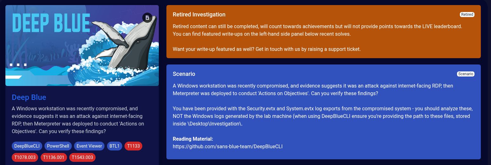

> **Disclaimer:** This investigation is retired content from Blue Team Labs Online. Write-up published in accordance with BTLO platform rules.

*Write-up by [Miyu7x](https://github.com/Miyu7x) | TryHackMe: [Miyu7](https://tryhackme.com/p/Miyu7) | BTLO: [Miyu7x](https://blueteamlabs.online/public/user/Miyu7x)*

---

## Scenario

A Windows workstation was recently compromised, and evidence suggests it was an attack against internet-facing RDP, then Meterpreter was deployed to conduct 'Actions on Objectives'. Can you verify these findings?

**Files provided:** Security.evtx, System.evtx
**Tool:** DeepBlueCLI
**Reading Material:** https://github.com/sans-blue-team/DeepBlueCLI

**Tags:** DeepBlueCLI, PowerShell, Event Viewer, BTL1, T1133, T1078.003, T1136.001, T1543.003

---

## Investigation Notes

PS C:\Users\BTLOTest\Desktop\Investigation\DeepBlueCLI-master> .\DeepBlue.ps1 ..\Security.evtx

PS C:\Users\BTLOTest\Desktop\Investigation\DeepBlueCLI-master> .\DeepBlue.ps1 ..\System.evtx

---

## Questions

**Q1. Which user account ran GoogleUpdate.exe?**

**Answer: Mike Smith**

---

**Q2. At what time is there likely evidence of Meterpreter activity? (Format: MM/DD/YYYY HH:MM:SS)**

**Answer: 04/10/2021 10:48:14**

---

**Q3. What is the name of the suspicious service created?**

**Answer: rztbzn**

---

**Q4. Identify the malicious executable downloaded to gain a Meterpreter reverse shell, between 10:30 and 10:50 AM on April 10th 2021. (Format: username, filename.exe)**

**Answer: Mike Smith, serviceupdate.exe**

---

**Q5. What was the command line used to create the persistence account? (Between 11:25 AM and 11:40 AM on April 10th 2021)**

**Answer: net user ServiceAct /add**

---

**Q6. What two local groups was this new account added to? (Format: Group1, Group2)**

**Answer: Administrators, Remote Desktop Protocol**

